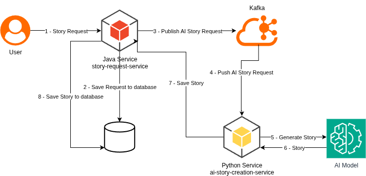

# AI Story Creation Service

This is a service that serves as example for the stitch-your-traces blog project. It reads creation requests from a Kafka
queue, creates them using generative AI, and then notifies Story Creation Service about the result.

This is a Python application.

The story request flow is as follows:

