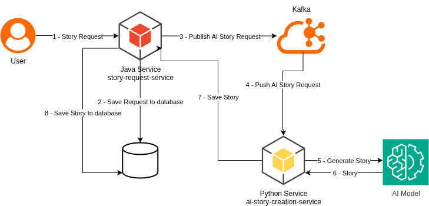

# Story Request Service

This is a service that serves as example for the stitch-your-traces blog project. It allows users to request
a story from a creation service and then check the status of the request later.

This is a Spring Boot Java application.

The story request flow is as follows:

